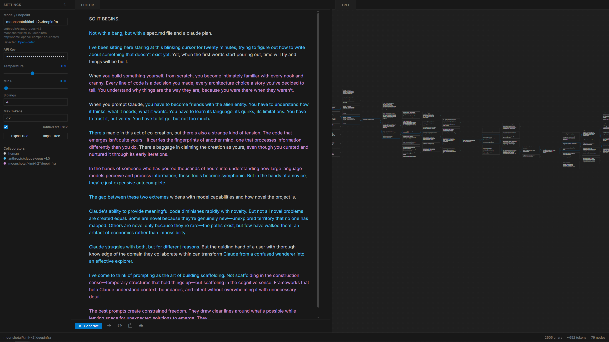

# WebLoom

A tree-based text completion explorer for base LLMs. Generate multiple completions simultaneously, branch from any node, and navigate through possibility space on an infinite canvas. Pure static site - just open index.html and start exploring.



## Quick Start

1. **Open `index.html`** in any modern browser
2. **Enter your API key** in the settings sidebar
3. **Start typing** in the editor to create your seed text
4. **Click Generate** (or Ctrl+Enter) to create branches

No server, no installation, no dependencies. Works locally or hosted on GitHub Pages.

## Creating and Exploring Trees

**Starting a Tree:**
- Just start typing in the editor - a root node is created automatically
- Your text appears in the tree view on the right

**Generating Branches:**
- Click any node in the tree to select it
- Click the `+` button or press Generate to create child completions
- Adjust "Siblings" in settings to generate multiple alternatives at once
- All siblings generate in parallel

**Editing:**
- Edit any text directly in the editor
- Human text appears in white, model text in colors
- Inserting text into model-generated sections creates new human nodes
- Hover over text to see which model generated it

**Navigation:**
- Click and drag the tree canvas to pan
- Scroll to zoom in/out
- Click any node to select it and view its full context in the editor

## Settings

**Model / Endpoint:**
- OpenRouter model: `anthropic/claude-opus-4.5` or `deepseek/deepseek-v3-base`
- Provider targeting: `moonshotai/kimi-k2::deepinfra`
- Local server: `http://localhost:1234/v1`

**Temperature:** Controls randomness. Higher = more creative, lower = more focused.

**Min P:** Minimum probability threshold for token selection.

**Max Tokens:** Length of each completion.

**Siblings:** Number of parallel completions to generate (1-8 recommended).

**Untitled.txt Trick:** Enables a prompting technique for Anthropic models to encourage continuation rather than conversation.

## Endpoints

**OpenRouter:**
- Enter any model in `provider/model-name` format
- Get your API key from https://openrouter.ai/settings/keys

**Provider Targeting (`::` syntax):**
- Force a specific backend: `moonshotai/kimi-k2::deepinfra`
- Format: `model::provider`

**OpenAI-Compatible Servers:**
- Enter any URL ending in `/v1`: `http://localhost:1234/v1`
- Works with LM Studio, vLLM, llama.cpp, text-generation-webui, tabbyAPI, etc.
- Use the separate OAI API Key and OAI Model fields for these endpoints

## Features

- **Color-coded text:** Each model gets a unique color in the editor
- **Model legend:** Shows all collaborators in the sidebar
- **Export/Import:** Save and load trees as JSON files
- **Auto-save:** Tree state persists in browser localStorage
- **Drag panels:** Swap editor and tree positions by dragging tabs
- **Resizable panels:** Drag the divider between panels

## Keyboard Shortcuts

- **Ctrl+Enter:** Generate completions from current node
- **Enter:** Insert newline in editor

## File Structure

```
webloom/
├── index.html      # Main HTML file
├── index.css       # All styles
├── app.js          # App initialization and UI
├── editor.js       # Text editor with tree sync
├── tree.js         # Tree data structures
├── tree-view.js    # SVG tree visualization
├── generation.js   # Completion generation
└── api.js          # API client for OpenRouter/OpenAI
```

## Contributing

Contributions are welcome! Feel free to submit issues and pull requests.
